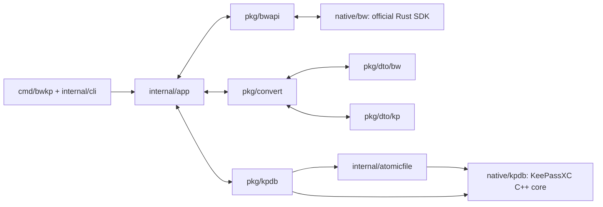
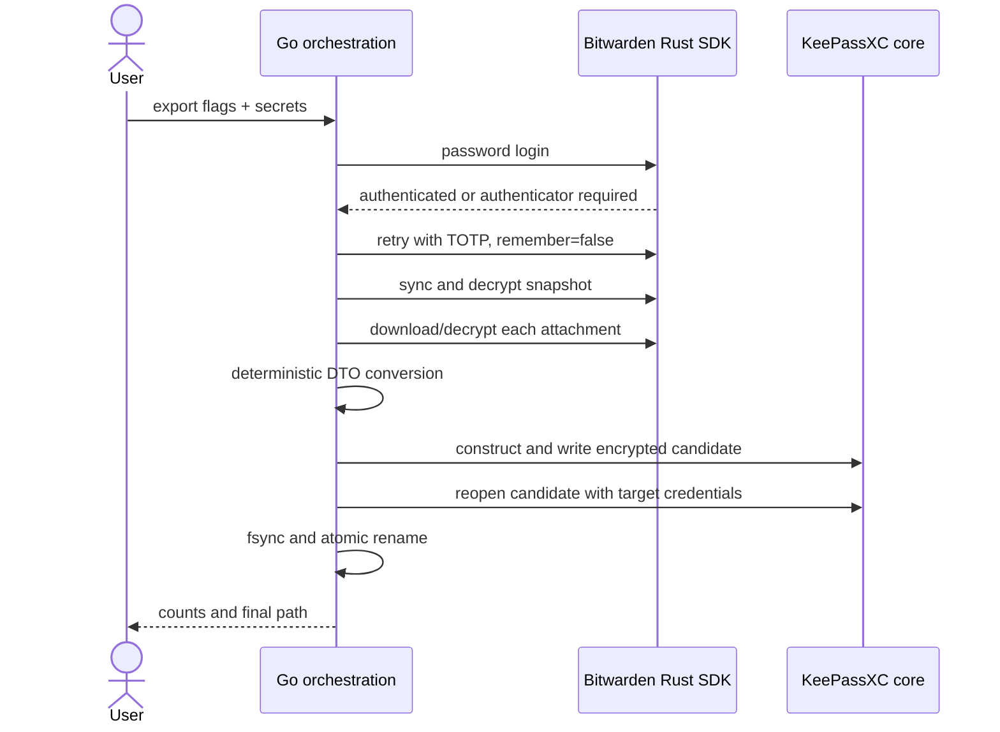
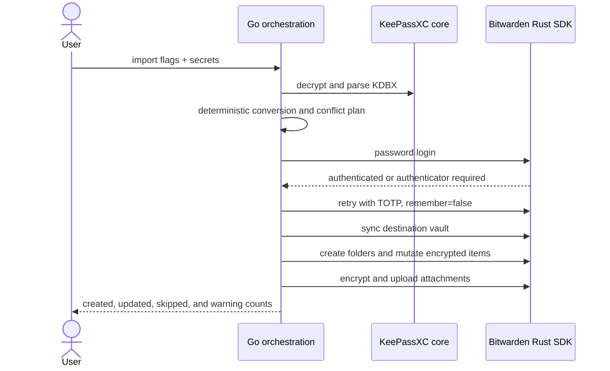

# Architecture

The public Go packages define stable interfaces and neutral DTOs. Native SDK
types remain behind C ABIs so an upstream update does not ripple through the
converter.

## Package responsibilities

- `cmd/bwkp`: process entry point only.
- `internal/cli`: flags, prompting, endpoint selection, and user-facing output.
- `internal/app`: login/sync/download/convert/write orchestration through small
  interfaces; owns lifetime and secret clearing.
- `internal/native`: CGo declarations and buffer ownership for both native
  libraries. Non-native stubs keep unit tests portable.
- `internal/atomicfile`: same-directory encrypted staging, verification, fsync,
  and rename.
- `internal/prompt`, `internal/security`: terminal input, secret-file checks,
  and best-effort memory clearing.
- `pkg/bwapi`: endpoint and session interfaces plus the official-SDK adapter.
- `pkg/dto/bw`: decrypted, SDK-neutral vault snapshot.
- `pkg/dto/kp`: writer-neutral database tree.
- `pkg/convert`: pure deterministic mapping; no I/O and no SDK dependency.
- `pkg/kpdb`: database credentials plus reader and writer interfaces.
- `native/bw`: Rust ownership of login, 2FA, sync, organization crypto, item
  encryption/decryption, vault mutations, and attachment transfer/crypto.
- `native/kpdb`: C++ ownership of KeePassXC object parsing/construction, KDF
  calibration, KDBX 4.1 writing, and authenticated reopen verification.
- `native/ffi`: Rust C ABI for Bitwarden only.

Import reverses this flow: KeePassXC decrypts and parses the KDBX directly into
the neutral DTO, the pure converter creates a deterministic mutation plan, and
the official SDK encrypts folders, records, and attachments before API upload.
All conflicts and folder ambiguities are planned before the first mutation.

## Export sequence

All cross-language calls exchange length-delimited JSON or byte buffers.
Sessions are opaque Rust-owned handles. C++ and Rust catch failures at their ABI
boundaries; foreign exceptions and panics never cross into Go.

## Import sequence

The conversion and conflict plan is completed before the first remote mutation.
The import then applies that plan in stable order. Unlike export, import does
not create a local output file.
